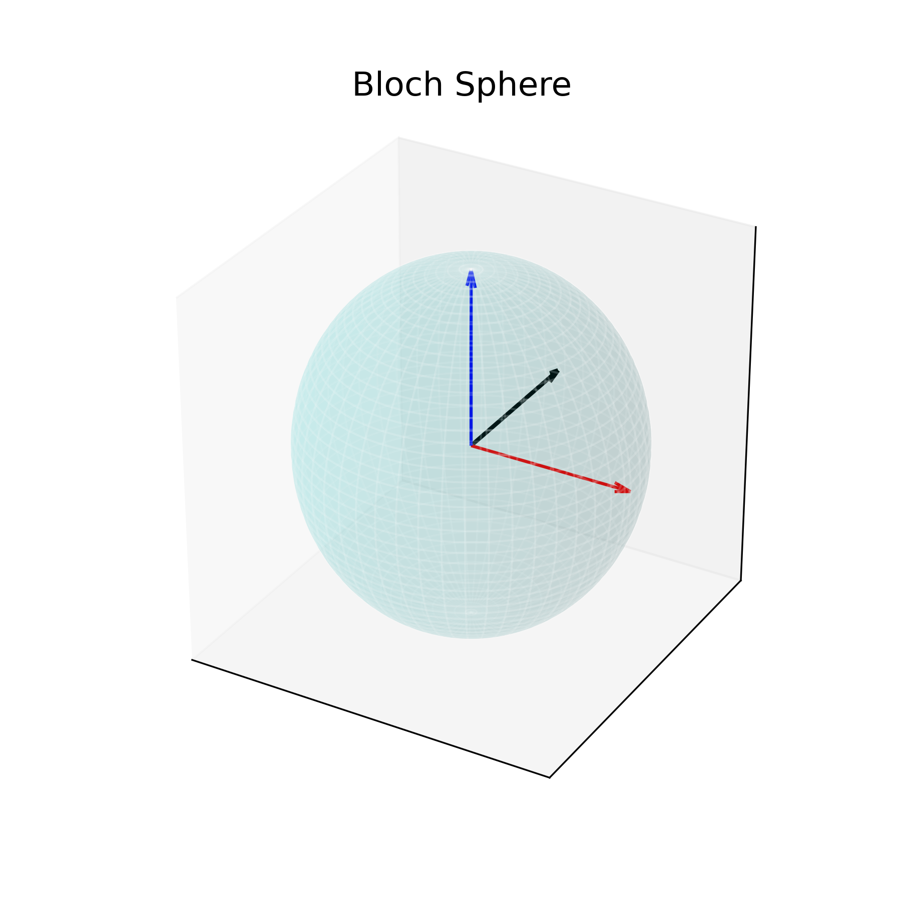
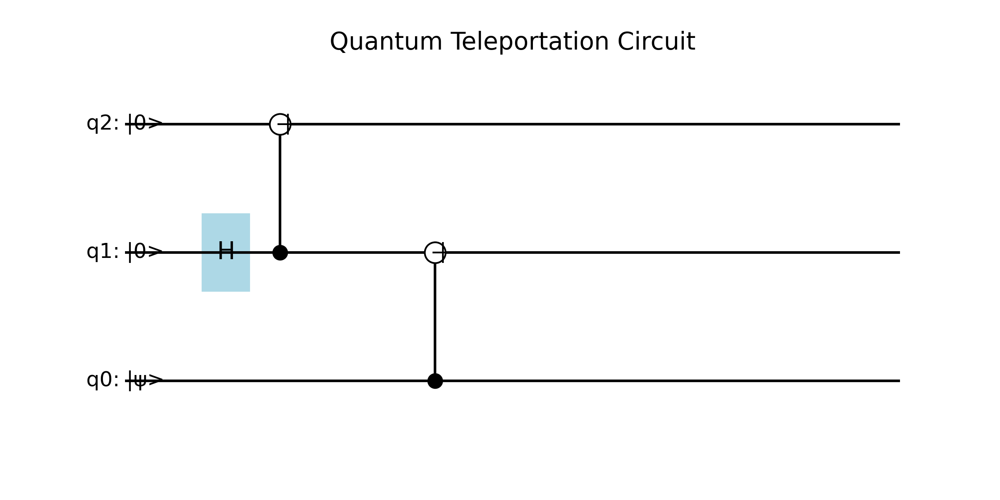

# Quantum Simulator App

Bu proje, **Streamlit** kullanarak temel kuantum algoritmalarını simüle eden ve görselleştiren bir eğitim uygulamasıdır. Uygulama, Qiskit kullanmadan Python ve Matplotlib ile geliştirilmiştir.

## 🚀 Özellikler

- Tek qubit kapıları ile kuantum durumu simülasyonu
- Bloch küresi görselleştirmesi
- Kuantum Teleportation (Bell pair) demosu
- Adım adım kapı uygulama modu
- Docker ile kolay kurulum ve çalıştırma
- GitHub Actions ile otomatik Docker Hub yükleme

---

## 📦 Kurulum

### 1. Yerel Çalıştırma

```bash
# Bağımlılıkları yükle
pip install -r requirements.txt

# Örnek görselleri üret
python generate_images.py

# Uygulamayı başlat
streamlit run streamlit_quantum_simulator_app_extended.py
```

### 2. Docker ile Çalıştırma

```bash
# Docker Hub'dan çek
docker pull <dockerhub_kullanici_adiniz>/quantum-simulator:latest

# Çalıştır
docker run -p 8501:8501 <dockerhub_kullanici_adiniz>/quantum-simulator:latest
```

---

## 📊 Örnek Görseller

### Bloch Küresi

Bloch küresi, bir qubit’in tüm olası durumlarını görselleştirir.




### Kuantum Teleportation Devresi

Aşağıda, bir qubit’in durumunu fiziksel olarak taşımadan başka bir qubit’e aktarımını gösteren devre şeması yer alıyor.




---

## 📜 Proje Yapısı

```
.
├── streamlit_quantum_simulator_app_extended.py   # Ana uygulama dosyası
├── requirements.txt                              # Python bağımlılıkları
├── Dockerfile                                    # Docker yapılandırması
├── README.md                                     # Bu dosya
├── generate_images.py                            # Örnek görselleri üreten script
├── images/                                       # Görseller
└── .github/workflows/docker-build.yml            # GitHub Actions workflow
```

---

## ⚙️ GitHub Actions

Bu repo, **main** branch'e yapılan her push sonrası otomatik olarak Docker imajını build edip Docker Hub'a yükler.

Secrets olarak aşağıdakileri eklemeniz gerekir:

- `DOCKERHUB_USERNAME` → Docker Hub kullanıcı adınız
- `DOCKERHUB_PASSWORD` veya `DOCKERHUB_TOKEN` → Docker Hub şifresi veya token

---

## 📚 Kuantum Bilgisayar Kavramları

### Bloch Küresi

Bloch küresi, tek bir qubit'in kuantum durumunu geometrik olarak görselleştirmek için kullanılan üç boyutlu bir küredir. Küre üzerindeki her bir nokta, qubit'in alabileceği saf durumlardan birine karşılık gelir.

Bir qubit'in genel durumu şu denklemle ifade edilir:

∣ψ⟩=cos( 
2
θ
​
 )∣0⟩+e 
iϕ
 sin( 
2
θ
​
 )∣1⟩
Bu denklemde yer alan açılar, durumu küre üzerinde bir vektör olarak tanımlar:

θ (theta): Kutup açısıdır. Z ekseni ile qubit'in durum vektörü arasındaki açıdır (0 ≤ θ ≤ π).

φ (phi): Azimut açısıdır. X ekseninden başlayarak XY düzlemindeki faz açısını belirtir (0 ≤ φ < 2π).


### Kuantum Teleportation

Kuantum teleportation, bilinmeyen bir kuantum durumunu fiziksel olarak taşımadan başka bir qubit'e aktarma protokolüdür. Bell pair (EPR çifti) ve klasik iletişim kullanır.

---

## 👨‍💻 Katkıda Bulunma

1. Fork'la
2. Yeni bir branch oluştur (`git checkout -b feature/yenilik`)
3. Değişikliklerini yap ve commit et
4. Branch'i push et ve Pull Request aç

---

## 📄 Lisans

MIT Lisansı altında dağıtılmaktadır.
